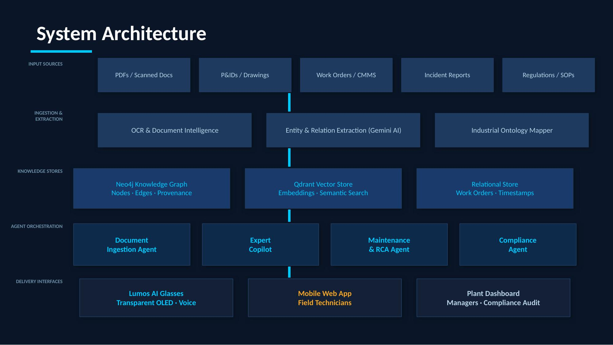
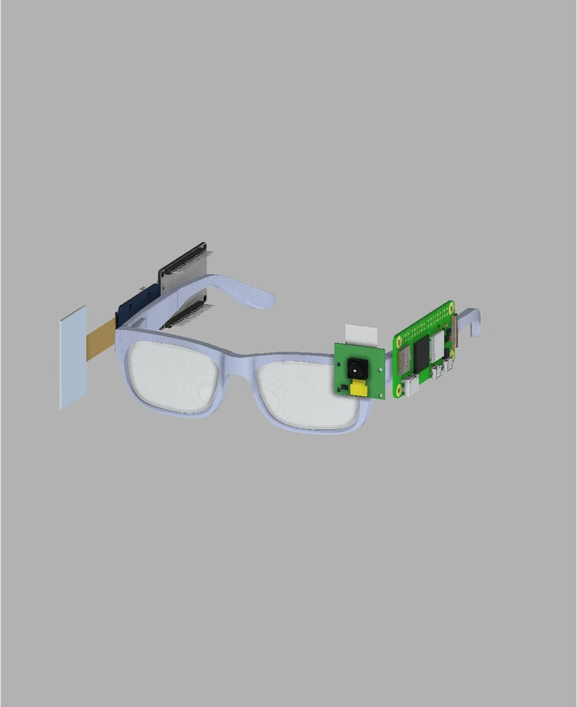
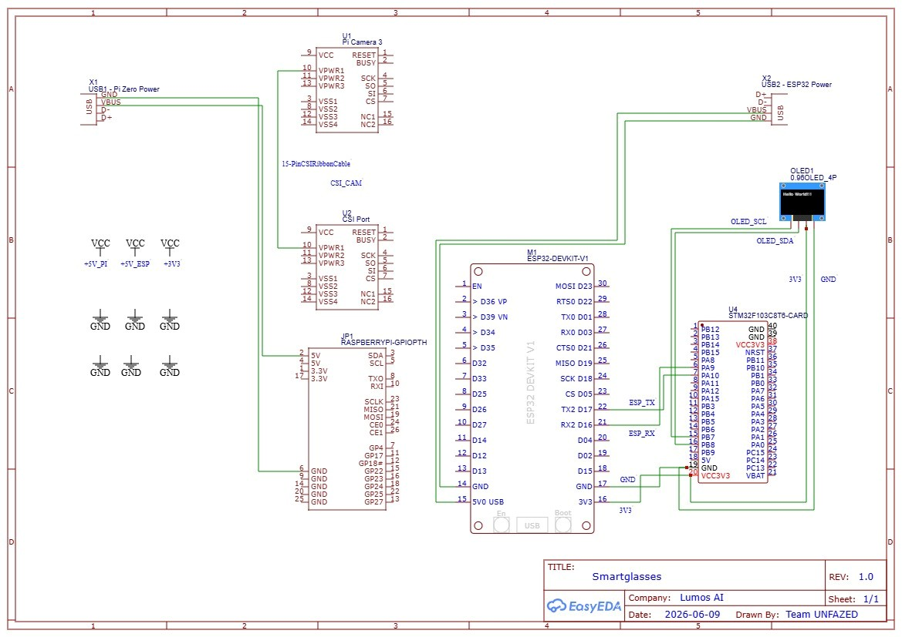

<div align="center">

# 🔆 Lumos AI

**Industrial Knowledge Intelligence Platform**

> *"Turning a plant's scattered documents into a living, queryable knowledge graph — delivered hands-free through AI-powered smart glasses."*

Empowering industrial maintenance and field technicians with context-aware, real-time intelligence.

[](LICENSE)
[](https://www.python.org/)

</div>

---

## 🏆 Recognition

Our Team Unfazed project **Lumos AI** won **India's largest GenAI student challenge** at the **OpenAI Academy × NxtWave Buildathon Maharashtra**, receiving a prize of **₹5,00,000** at the India AI Impact Summit 2026.

📄 [Read the full article →](https://etedge-insights.com/trending/openai-academy-x-nxtwave-buildathon-maharashtra-team-wins-indias-largest-genai-student-challenge-at-india-ai-impact-summit-2026/)

---

## 🚨 The Problem

Millions of engineer hours are lost searching for information that already exists. While digital systems hold vast amounts of data, the real problem is **knowledge custody loss**:

- **35%** of engineer hours are lost searching for fragmented information.
- The average large Indian plant relies on **7–12 disconnected document systems**.
- **18–22%** of unplanned downtime is caused by an incomplete equipment history.
- With **25%** of experienced industrial engineers retiring within a decade, decades of tribal knowledge (*"this pump always fails this way when it's humid"*) disappears permanently because it was never captured in a structured way.

This leaves modern industrial plants vulnerable to knowledge gaps and critical downtime.

---

## 💡 Our Vision

We believe industrial knowledge should not be fragmented in static PDFs or isolated databases.

Instead of just offering a basic search tool, we set out to build an intelligent, queryable ecosystem that actively understands relationships between equipment, procedures, and past incidents. This led to a unified platform with two complementary AI capabilities:

| AI Agent | Designed For |
|---|---|
| **Expert Knowledge Copilot** | Answering complex operational & maintenance questions by traversing a knowledge graph, checking superseded procedures, and always citing sources. |
| **Compliance Agent** | Safety-critical field checks against SOPs and regulations (PASS/FLAG/UNKNOWN) — running entirely on a **local** offline model. |

Delivered through **Lumos AI Glasses** for hands-free field use and a **Mobile Web Console** for accessible fallback, ensuring critical intelligence is always available.

---

## 🏗️ Architecture

Plain RAG answers *"what does this document say?"* Our Knowledge Graph answers *"what is true across all documents about this equipment?"* — traversing relationships no vector search can understand.



### The Knowledge Graph Advantage
> **Example — "Why does PMP-204 keep failing?"**
> `PMP-204` (Equipment) ← two incident reports linked by `SIMILAR_TO` → both linked via `REVISED_DUE_TO` to a `SUPERSEDES` relationship between SOP revisions → the system knows the 180-day procedure is outdated **and why**.
> **Result: Seven hops, five node types, one answer** — impossible for a flat vector search.

---

## ⚙️ Features at a Glance

**Expert Copilot (Cloud AI)**
- Hybrid graph + vector retrieval
- Confidence-scored, cited answers
- Automatic checks for superseded documents
- Powered by Gemini 2.5 Flash-Lite
- Documentation Gap tracking for low-confidence queries

**Compliance Agent (Local AI)**
- Zero cloud dependency for safety-critical checks
- Fully offline inference using Ollama + `qwen3-vl:4b`
- Real-time `PASS` / `FLAG` / `UNKNOWN` validation

**Hardware & Interfaces**
- Hands-free field operations via Lumos AI Glasses
- Raspberry Pi Zero W + CSI Camera integration
- Transparent OLED render (Waveshare 1.51")
- QR-encoded demo state capture
- Universal Mobile Web Console (HTML/JS) with live voice input

---

## 🔧 Hardware & Design

### Lumos AI Glasses





---

## 💻 Technology Stack

### Backend & AI Infrastructure
- **Framework:** Python 3.11 + FastAPI
- **Knowledge Graph:** Neo4j AuraDB
- **Vector Store:** Qdrant Cloud (768-dim normalized embeddings)
- **Document Extraction & Generation:** Gemini 2.5 Flash-Lite, Gemini `embedding-001`
- **Local AI:** Ollama (`qwen3-vl:4b` for compliance)

### Edge Hardware (Lumos AI Glasses)
- **Compute:** Raspberry Pi Zero W
- **Sensors:** CSI Camera
- **Display:** Transparent SSD1309 OLED
- **Software:** `picamera2`, OpenCV (QR decode), `luma.oled`

---

## 🚀 Setup & Getting Started

**Prerequisites:** Python 3.11+, a free Neo4j AuraDB instance, a free Qdrant Cloud cluster, a Gemini API key, and Ollama (`qwen3-vl:4b`).

**Installation**

```bash
git clone <your-repo-url>
cd lumos-ai
```

**1. Ingest Documents (Knowledge Graph + Vector Store)**
```bash
cd ingestion
pip install -r requirements.txt
cp .env.example .env   # Configure Gemini/Neo4j/Qdrant
python extract.py && python load_graph.py && python load_vectors.py
```

**2. Graph Enrichment for Compliance Agent**
```bash
cd ../compliance
pip install -r requirements.txt
cp .env.example .env   # Configure Neo4j + Gemini
python attach_full_text.py
```

**3. Run Local AI & API Backend**
```bash
ollama pull qwen3-vl:4b
uvicorn api:app --reload --host 0.0.0.0 --port 8000
```

**4. Open Mobile Console**
Update `API_BASE_URL` inside `webui/mobile_ui.html`, then open it in your browser.
Full setup instructions for the Pi Zero W glasses are available in `glasses/README.md`.

---

## 🎬 Demonstrations & Output

Real output from our running pipeline (not mocked):

> **Q: Why does PMP-204 keep failing?**
> A: PMP-204 experienced two identical mechanical seal failures within 3 weeks... Both are linked by a SIMILAR_TO relationship in the knowledge graph and trace to the same confirmed root cause: elevated ambient humidity accelerates seal pitting...
> ✅ `flagged_recurring_pattern: True` · confidence `1.0`

---

## 📈 Honest Scope & Path to Impact

Built for the **ET AI Hackathon 2026 — Problem Statement #8**, these are our deliberate MVP decisions:

- **QR-encoded scenarios:** The glasses currently use QR markers to simulate computer vision state capture. Downstream reasoning (retrieval, graph traversal, compliance checks) is completely real.
- **Hybrid AI:** Gemini is in the loop for general extraction, while safety-critical compliance is fully local (Ollama). There is a clear migration path to full offline capability.
- **Synthetic Documents:** Our dataset mirrors real SOPs and incident reports to avoid proprietary risks during the build phase.

Lumos AI empowers technicians with the exact knowledge they need, exactly when they need it, ensuring that decades of industrial expertise are never lost.

---

## 👥 Team

Built by **Team Unfazed** — passionate about using artificial intelligence to solve real-world industrial knowledge challenges and empower front-line workers.

---

## 📄 License

This project is licensed under the [MIT License](LICENSE).

<div align="center">
**Built for ET AI Hackathon 2026 · Problem Statement #8**
</div>
